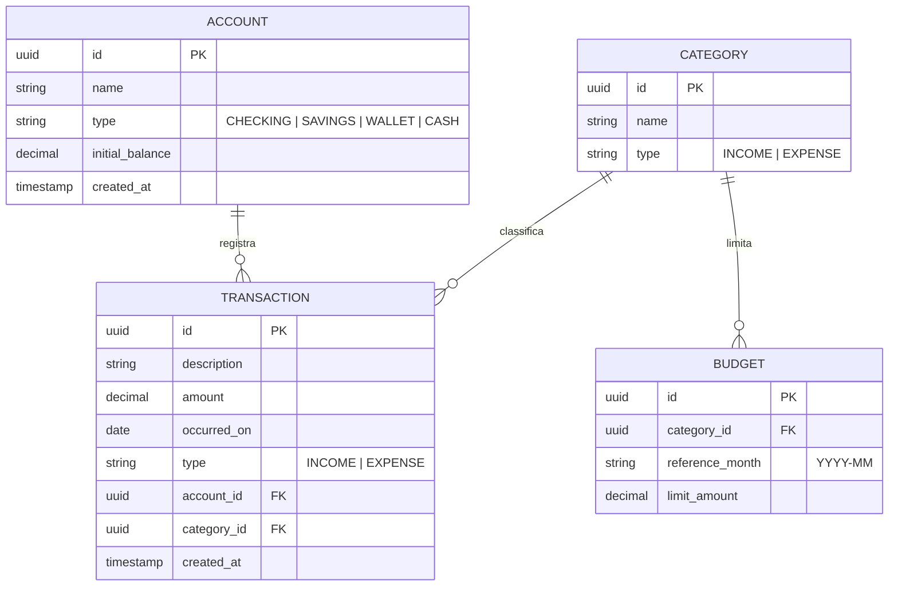

# Arquitetura — Personal Financial Control

> Documento de design da API REST de controle financeiro pessoal. Descreve as
> decisões técnicas, a organização do código e o modelo de dados. É um
> **blueprint**: define o alvo antes da implementação e serve de guia para
> dividir o trabalho em trilhas independentes durante o desenvolvimento.

---

## Visão geral

A aplicação é uma **API REST** que gerencia finanças pessoais — contas,
categorias, transações e orçamentos — com endpoints de agregação para
relatórios (gastos por categoria, orçado vs. realizado, saldo por conta).
É a evolução de uma planilha de controle financeiro para um serviço HTTP
versionado, testável e deployável.

Não há interface gráfica neste escopo: a entrega é a API documentada via
OpenAPI. Um frontend pode consumi-la depois, sem alterar o backend.

---

## Stack e justificativa

| Camada | Tecnologia | Por quê |
|---|---|---|
| Linguagem | Java 21 (LTS) | Base sólida; LTS dá suporte longo e é o que o mercado pede |
| Framework | Spring Boot 3.x | Padrão de fato para APIs Java; convenção sobre configuração |
| Persistência | Spring Data JPA + Hibernate | Reduz boilerplate de acesso a dados; repositórios declarativos |
| Boilerplate de classes | Lombok (`@Getter`/`@Setter`/`@AllArgsConstructor`) | Gera getters, setters e construtores em tempo de compilação para entidades e DTOs — ver [ADR-006](docs/adr/ADR-006-lombok-em-entidades-e-dtos.md) |
| Banco | PostgreSQL | Relacional maduro; modela bem contas/transações/orçamentos |
| Migrations | Flyway | Versiona o schema junto do código — sem "deu certo na minha máquina" |
| Validação | Bean Validation (Jakarta) | Valida entrada na borda, antes da regra de negócio |
| Documentação | springdoc-openapi (Swagger UI) | Gera a doc a partir do código; sempre sincronizada |
| Ambiente local | Docker Compose | Sobe o Postgres igual em qualquer máquina |
| Deploy | Render | Deploy gratuito de container com Postgres gerenciado |

---

## Decisão arquitetural central: organização por funcionalidade

O código é organizado **por feature** (`package-by-feature`), não por camada
técnica (`package-by-layer`). Cada funcionalidade — conta, categoria,
transação, orçamento — é um pacote autocontido com suas próprias camadas.

**Por que feature e não layer:**

- **Manutenção:** tudo que muda junto fica junto. Mexer em "transação" é abrir
  um pacote, não caçar arquivos espalhados em `controllers/`, `services/`,
  `repositories/`.
- **Testabilidade:** cada feature tem fronteira clara, então o teste de uma não
  arrasta o resto do projeto.
- **Trabalho paralelo:** features independentes podem ser desenvolvidas ao mesmo
  tempo sem conflito — o que permite quebrar o desenvolvimento em trilhas
  paralelas (uma sessão por feature) sem que uma pise na outra.

O trade-off: para um projeto trivial, `package-by-layer` é mais familiar. A
partir de algumas features, porém, a organização por funcionalidade escala
melhor — e é o ponto que se quer demonstrar aqui.

---

## Estrutura de diretórios

```text
src/main/java/com/pfc/
├── PersonalFinanceApplication.java   # ponto de entrada
├── account/                          # feature: Contas
│   ├── AccountController.java
│   ├── AccountService.java
│   ├── AccountRepository.java
│   ├── Account.java                  # entidade JPA
│   └── dto/                          # AccountRequest, AccountResponse
├── category/                         # feature: Categorias
├── transaction/                      # feature: Transações
├── budget/                           # feature: Orçamentos
├── report/                           # feature: Relatórios (sem entidade)
│   ├── ReportController.java
│   ├── ReportService.java
│   └── dto/
└── shared/                           # transversal a todas as features
    ├── config/                       # OpenAPI, CORS, etc.
    └── exception/                    # handler global + exceções de domínio

src/main/resources/
├── application.yml
└── db/migration/                     # scripts Flyway (V1__init.sql, ...)
```

---

## Camadas dentro de cada feature

Cada feature segue o mesmo fluxo de uma requisição:

```text
HTTP  →  Controller  →  Service  →  Repository  →  Banco
              ↑            ↑
            DTO        regra de
        (entra/sai)    negócio
```

| Camada | Responsabilidade | Não faz |
|---|---|---|
| **Controller** | Receber/responder HTTP, validar DTO de entrada | Regra de negócio |
| **Service** | Regra de negócio, controle transacional (`@Transactional`) | Conhecer HTTP |
| **Repository** | Acesso a dados (Spring Data JPA) | Regra de negócio |
| **Entidade** | Mapear a tabela do banco | Sair pela API diretamente |
| **DTO** | Contrato da API (request/response) | Conter lógica |

**Por que separar DTO da entidade:** a entidade JPA é o modelo interno do
banco. Expô-la direto na API acopla o contrato HTTP ao schema — qualquer
mudança no banco vaza para quem consome a API. O DTO isola os dois lados:
o banco evolui sem quebrar o cliente, e vice-versa.

---

## Features e dependências

A ordem de construção segue as dependências entre features — é o que define o
que pode ser feito em paralelo e o que precisa vir antes.

| Feature | Responsabilidade | Depende de |
|---|---|---|
| `shared` | Config, handler de erro, base comum | — (fundação) |
| `account` | CRUD de contas | shared |
| `category` | CRUD de categorias | shared |
| `transaction` | Lançamentos de receita/despesa | account, category |
| `budget` | Limites de gasto por categoria/mês | category |
| `report` | Agregações (gastos por categoria, orçado vs. realizado) | transaction, budget |

`account` e `category` não dependem uma da outra → paralelizáveis.
`transaction` precisa das duas. `report` vem por último, pois lê tudo.

---

## Modelo de dados



**Notas de modelagem:**

- **Valores monetários em `DECIMAL`, nunca `double`/`float`** — ponto flutuante
  acumula erro de arredondamento e em dinheiro isso é inaceitável.
- **`type` como enum (`INCOME`/`EXPENSE`)** mantém receita e despesa na mesma
  tabela de transações, simplificando os relatórios.
- **`budget` é orçamento por categoria e mês** — é o equivalente ao "orçado"
  da planilha; o "realizado" sai da soma das transações daquela categoria/mês.

---

## Tratamento de erros

Erros são centralizados num `@RestControllerAdvice` global, para que toda
falha responda no mesmo formato em vez de cada controller tratar do seu jeito.

- **Exceções de domínio** explícitas: `ResourceNotFoundException` (404),
  `BusinessException` (422/400 conforme o caso).
- **Resposta padronizada** no formato `ProblemDetail` (RFC 7807, nativo do
  Spring 6): `type`, `title`, `status`, `detail`, `instance`.

**Por que padronizar:** quem consome a API trata erro de um jeito só, e o log
fica previsível. Sem isso, cada endpoint inventa seu próprio formato de erro.

---

## Decisões e trade-offs

Registro curto das escolhas conscientes (estilo ADR enxuto):

1. **Sem autenticação no MVP.** O foco é o domínio financeiro. Auth
   (Spring Security + JWT) fica como evolução futura, num pacote `auth`
   próprio — adicioná-la não deve exigir reescrever as features existentes.
2. **Flyway desde o início.** Adiciona um passo, mas dá histórico do schema e
   deploy reproduzível. O custo é baixo perto do ganho em previsibilidade.
3. **UUID como chave primária.** Evita expor contagem de registros e facilita
   geração no lado da aplicação. Trade-off: ocupa mais que um `bigint`
   sequencial — irrelevante nesta escala.
4. **`report` sem entidade própria.** Relatório é leitura agregada, não estado.
   Modelá-lo como entidade seria duplicar dado que já vive em `transaction`.
5. **Lombok em entidades e DTOs.** Elimina getters/setters/construtores
   repetidos em todas as features. Em entidades JPA usamos apenas `@Getter` e
   `@Setter` — nunca `@Data` — porque ele gera `equals`/`hashCode`/`toString`
   sobre todos os campos, o que quebra com associações `@ManyToOne` carregadas
   via `FetchType.LAZY` e proxies do Hibernate. Detalhes em
   [ADR-006](docs/adr/ADR-006-lombok-em-entidades-e-dtos.md).

---

## Fases de evolução

O desenvolvimento segue três fases, alinhadas às dependências entre features:

1. **Fundação** — projeto, `application.yml`, Docker Compose do Postgres,
   `shared` (config + handler de erro), primeira migration. Sequencial.
2. **Features independentes** — `account` e `category` em paralelo, cada uma
   com suas camadas e testes. Depois `transaction` (depende das duas) e
   `budget`.
3. **Convergência** — `report` (lê tudo), documentação OpenAPI e deploy.

Evoluções previstas após o MVP: autenticação, paginação/filtros nos
endpoints de listagem e exportação de relatórios.
